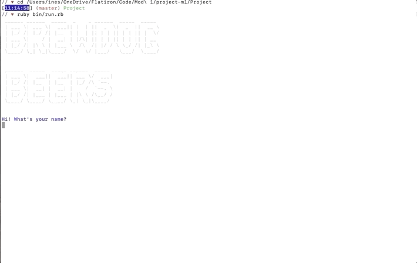
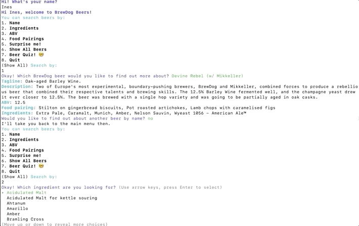
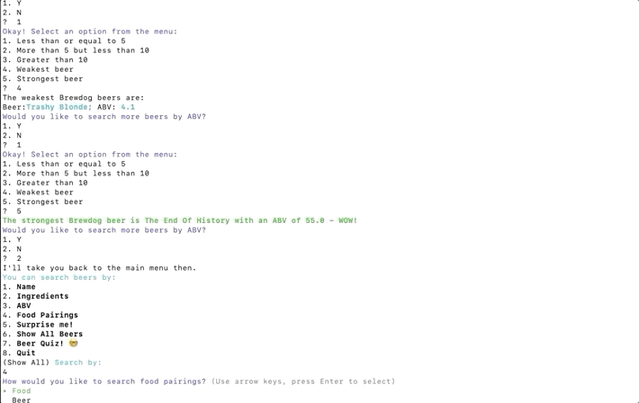
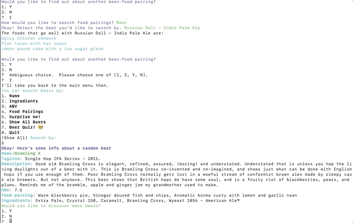
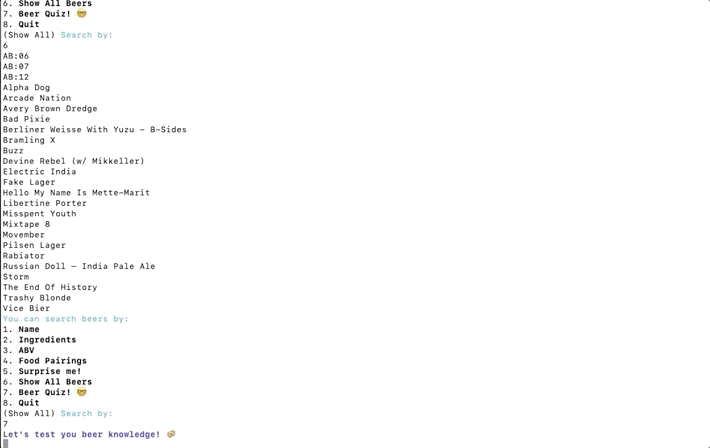

# Brewdog Beers

## [Demo](https://youtu.be/TkP4gItpzp0)

## About

Brewdog Beers is a CLI app built with Ruby using Brewdog Beer's public API.
This app was built for Flatiron School's first module final.

## Technologies

- Ruby
- RestfulAPIs
- TTY

## Features

### The app allows you to search for beers by name:

### To search for beers based on ingredients:

### To search by ABV:

### To look at food pairings based on meal and/or beer:

### You can also see details of a random beer or see all beers available

### After learning about the beers, you can test your knowledge

### and.. hopefully win

**Created by Ines Guerrero and Katherine Wren**
